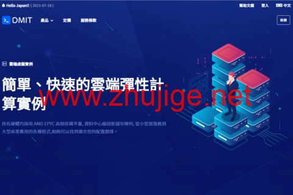

# DMIT 洛杉矶 CN2 GIA 高防 VPS 补货：2核2G配置，季付仅需$56.99

---

如果你正在寻找一款既能保证国内访问速度，又能抵御大流量 DDoS 攻击的美国 VPS，那这次 DMIT 的补货值得关注。这家 2017 年成立的服务商，主打洛杉矶机房的 CN2 GIA 线路产品，最大的特点是稳定——不是那种"偶尔抽风"的稳定，而是在线率能让你放心睡觉的那种。

这次补货的 sPro 系列更特别：去程走 Cloudflare Magic Transit 加持，回程是 CN2 GIA，还自带高达 5Tbps 的 DDoS 防护能力。对于需要跑业务、怕被攻击、又希望国内用户访问流畅的场景来说，这个配置组合算是找到了平衡点。支付方式包括支付宝、PayPal 和信用卡，国内用户购买毫无门槛。

---

## 为什么选择这款 VPS？

**1. 线路质量有保障**

DMIT 的 CN2 GIA 回程线路，在晚高峰时段的表现明显好于普通线路。去程通过 Cloudflare 的网络优化，回程直连电信/联通/移动的 GIA 节点，延迟低、丢包少。如果你之前用过那些"白天能用、晚上卡成PPT"的 VPS，就能体会到线路质量的重要性。

**2. DDoS 防护不是摆设**

5Tbps 的防护能力听起来夸张，但对于经常被攻击的业务来说，这是刚需。Cloudflare Magic Transit 的防护机制会在流量进入服务器前就完成清洗，不会因为攻击导致 IP 被封或者服务器宕机。这比那些"遇到攻击就拔网线"的商家要靠谱得多。

**3. 配置够用，价格不贵**

2核 CPU、2GB 内存、20GB SSD 存储、1000GB 月流量、100Mbps 带宽，季付 $56.99（约每月 $19）。这个配置跑个人博客、小型业务、代理节点都够用。关键是流量给得足，不用天天盯着面板看流量用了多少。

---

## 适合什么场景？

**建站用户**  
如果你的网站主要面向国内用户，但又想放在海外避免备案麻烦，CN2 GIA 线路能保证访问速度不会太拉胯。配合 Cloudflare 的 CDN，基本能做到"用户无感知"。

**代理节点**  
对于需要稳定连接的代理服务，线路质量和防护能力是核心。DMIT 的在线率很高，不会三天两头出问题。而且 DDoS 防护能避免节点被打死，不用半夜起来处理故障。

**小型业务系统**  
跑个 API 服务、数据采集脚本、自动化工具之类的，这个配置完全够用。重点是稳定性好，不用担心突然掉线导致业务中断。

如果你想要更全面的性能测试和网络质量对比，👉 [可以参考 DMIT 官方提供的详细测速数据和用户反馈](https://www.dmit.io/aff.php?aff=13832)，里面有不同地区的延迟测试和实际使用体验。

---

## 套餐详细配置

**PVM.LAX.sPro.CREATOR 套餐规格：**

- **CPU：** 2核心
- **内存：** 2GB RAM
- **存储：** 20GB SSD
- **流量：** 1000GB/月
- **带宽：** 100Mbps
- **线路：** 去程 Cloudflare Magic Transit，回程 CN2 GIA
- **防护：** 最高 5Tbps DDoS 防护
- **价格：** $56.99/季度（约 $19/月）
- **机房位置：** 美国洛杉矶

---

## 购买注意事项

1. **补货数量有限**  
   sPro 系列一直是 DMIT 的热门产品，补货后通常很快售罄。如果确定需要，建议尽早下单。

2. **付款方式灵活**  
   支持支付宝、PayPal、信用卡三种方式，国内用户直接用支付宝最方便。

3. **流量够用但不是无限**  
   1000GB 月流量对于大多数个人用户来说足够，但如果你要跑大流量业务（比如视频站、下载站），需要提前评估流量消耗。超出流量后会限速或额外收费。

4. **退款政策**  
   DMIT 提供有限的退款政策，具体条款建议购买前在官网确认。一般来说，如果服务有问题可以提工单解决，商家响应速度还不错。

---

## 总结

DMIT 这次补货的 sPro 套餐，核心优势就是"稳定+线路好+防护强"。如果你之前用过那些"便宜但不靠谱"的 VPS，就能体会到稳定性的价值。CN2 GIA 回程保证了国内访问速度，Cloudflare Magic Transit 解决了防护问题，配置也够日常使用。

对于需要长期稳定运行业务、不想频繁折腾的用户来说，这个价位（季付 $56.99）的性价比还是不错的。毕竟 👉 [DMIT 的服务质量和网络稳定性在同类产品中确实有口碑](https://www.dmit.io/aff.php?aff=13832)，适合那些"宁愿多花一点钱也不想半夜被叫起来处理故障"的场景。
